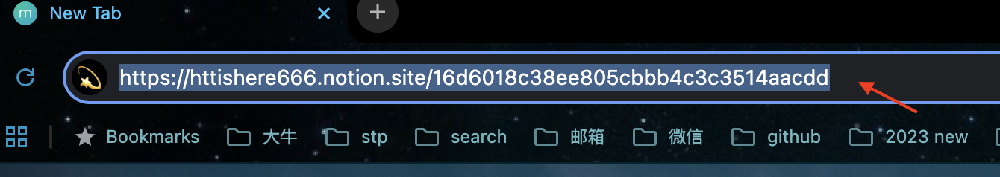
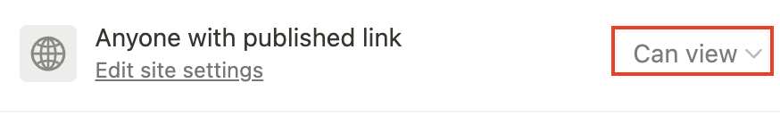
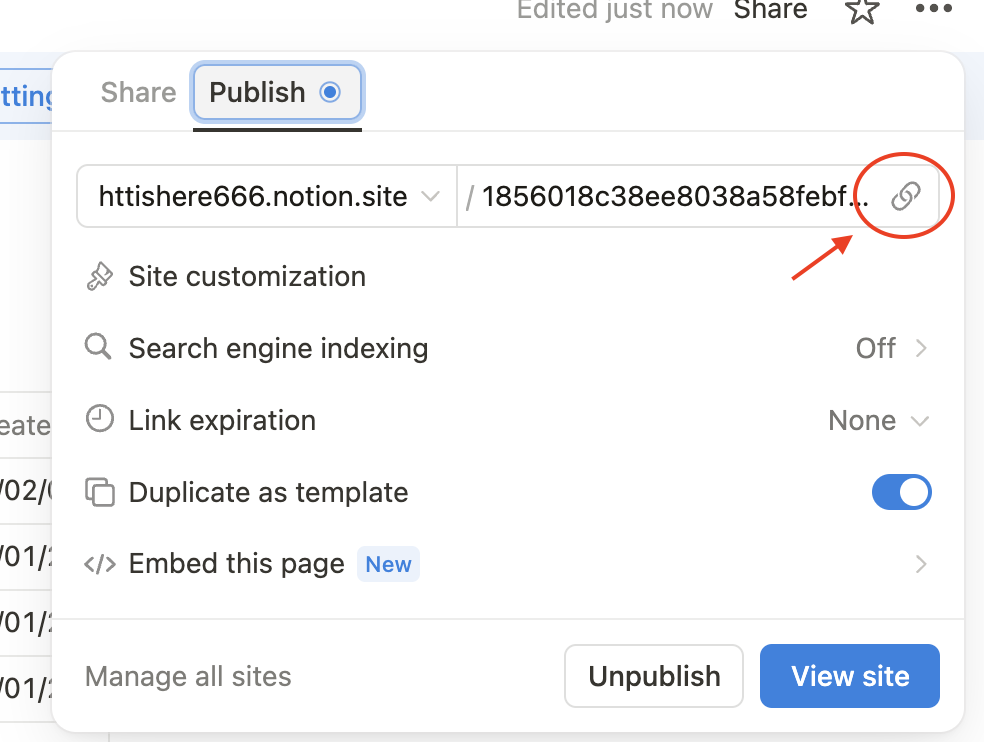

## 使用他人的模板

1. **找到模板**  
   你可以在Notion模板库中浏览，或通过网络分享的链接找到他人的模板。例如，Notion官网或社交平台上常有模板分享。

2. **访问模版**
   - 当你找到合适的模板时，可以先在浏览器内登录你自己的Notion账号
   - 在浏览器内**访问模版**（在浏览器地址栏粘贴模版链接进行访问）
   - 

3. **复制模板**  
   - 点击模板页面右上角的 **"Duplicate"（创建副本）** 按钮，`这个按钮有时候会被折叠在菜单内或者变成重复图标（❗️不是搭建于按钮）`。
   - 点击后，模板会通过你选择的工作区自动复制到你的Notion账户中，作为一个新的页面。
   - 你可以根据需求修改和调整模板内容。

## 将自己的页面发布为公开页面

1. **进入页面设置**  
   - 打开你想要发布的Notion页面。
   - 在页面右上角，点击 **"Share"（分享）** 按钮。

2. **启用公开链接**  
   - 在弹出的分享设置中，找到 **"Publish"（发布）** 选项，点击下面的`Publish（发布）`按钮。
   - 这样，Notion会生成一个公开链接，任何拥有此链接的人都可以查看你的页面。

3. **调整权限**（可选）  
   - 如果你希望他人可以把你的页面作为模版导入自己工作区使用，确保打开了 **"Duplicate as template"**（允许复制为模板）选项，反之将其关闭。
   - 如果你希望他人可以直接编辑当前页面，则在Share（分享）选项下修改这里的权限。
      

4. **分享链接**  
   - 复制生成的链接，并分享给他人，或通过社交媒体、邮件等方式公开。
      

