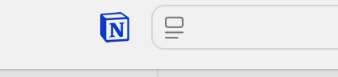

> **Notion Web Clipper** 是 Notion 提供的一款浏览器扩展，帮助用户快速将网页内容剪藏到 Notion 中。它支持保存网页内容、截图、以及链接，并且能够自动识别页面的结构（如标题、正文、图片等），方便用户高效管理和整理信息。

本文将详细介绍如何下载和使用 Notion Web Clipper。

---

## 一、下载 Notion Web Clipper

### 1.1、支持浏览器
Notion Web Clipper 扩展目前支持以下浏览器：
- **Google Chrome**
- **Mozilla Firefox**
- **Safari**

### 1.2、下载步骤
#### 1.2.1、Google Chrome 和 Safari
1. 打开 [Chrome 网上应用店](https://chrome.google.com/webstore/category/extensions) 或 [Safari 扩展商店](https://apps.apple.com/us/app/notion-web-clipper/id1559269364?mt=12)。
2. 在搜索框中输入 “Notion Web Clipper”。
3. 点击 **“添加到 Chrome”**（或 **“获取”**）。
4. 系统会提示确认，点击 **“添加扩展程序”**。

#### 1.2.2、Mozilla Firefox
1. 打开 [Mozilla Firefox 附加组件页面](https://addons.mozilla.org/en-US/firefox/addon/notion-web-clipper/)。
2. 点击 **“添加到 Firefox”**。
3. 点击 **“添加”** 确认安装。

### 1.3、安装完成
安装成功后，浏览器右上角（Safari在左上角）将出现 **Notion Web Clipper** 的图标。

---

## 二、使用 Notion Web Clipper

### 2.1、登录 Notion 帐号
在使用 Web Clipper 之前，确保已经登录到 Notion 帐号。如果尚未登录，你将在使用 Web Clipper 时被提示输入 Notion 的账户信息进行登录。

### 2.2、剪藏网页
1. 打开你想要保存的网页。
2. 点击浏览器右上角的 **Notion Web Clipper** 图标。
   
   - 如果你是首次使用，Notion Web Clipper 会提示你进行登录。
   
3. 登录后，Web Clipper 会自动识别页面内容，并弹出剪藏窗口。
   
   - **标题和内容**：Notion 会自动提取页面标题和正文内容。
   - **选择保存位置**：你可以选择将内容保存到特定的 Notion 页面或数据库中。可以直接选择已有页面，或者创建新的页面。

4. **自定义剪藏内容**：
   - 如果你只需要保存部分网页内容，可以使用 **"选择性剪藏"** 功能，通过选择网页中的特定段落、图片或截图进行保存。
   
5. **点击 “保存到 Notion”**：
   - 完成所有设置后，点击 **“保存到 Notion”**，网页内容就会自动被保存到你指定的页面。

### 2.3、查看剪藏的内容
保存完成后，切换到 Notion，你将看到该网页内容已经被自动导入。它会以块状结构出现，方便你后续进行整理和修改。

---

## 三、使用技巧

### 3.1、保存网页截图
在剪藏网页时，Notion Web Clipper 支持截图功能。你可以选择截取整个网页或只截取部分内容。这对于保存不支持文本复制的网页非常有用。

### 3.2、将网页保存为链接
除了保存网页内容外，Notion Web Clipper 还允许你将网页作为链接直接保存在 Notion 中。这样，你可以保留网页的原始格式，并且可以随时通过链接访问。

### 3.3、批量剪藏网页
如果你经常需要保存大量网页内容，可以在浏览器中批量打开网页，使用 Notion Web Clipper 逐一保存。Web Clipper 会为每个网页自动生成一条记录，便于你管理。

---

## 四、常见问题解答

### 4.1、如何修改剪藏的网页内容？
在 Notion 中，你可以随时编辑保存的网页内容。点击页面中的文本块或图片块，进行修改或删除。

### 4.2、Web Clipper 支持哪些网页格式？
Notion Web Clipper 支持大部分网站，包括文章、博客、新闻站点等。它能够识别并提取网页中的标题、正文、图片和链接。

### 4.3、无法保存网页怎么办？
如果在使用 Web Clipper 时遇到问题（如无法保存或加载），可以尝试：
- 确保浏览器已更新到最新版本。
- 清理浏览器缓存。
- 重新启动浏览器或尝试重新安装 Web Clipper。

---

## 五、总结

Notion Web Clipper 是一款非常实用的工具，可以帮助你高效地将网页内容保存到 Notion 中，便于整理、归档和后续查看。通过本文的介绍，你应该能够快速下载并开始使用 Notion Web Clipper。如果遇到问题，请参考常见问题解答部分，或访问 Notion 官方。
